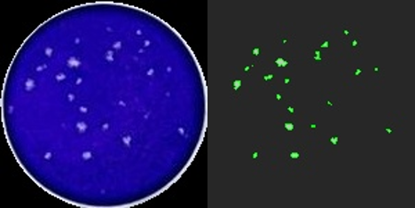

# VirPlaqCounter: <h3> tool for counting virological plaques from an images </h3> 

<a href=""></a>


This is a tool for automatic counting of virological plaques on a tablet:

* based on Hough transform and K-means
* processing of only 6-wells tablets is available now (see examples of images in the `/raw_data` folder)
* the result in excel format
* 2 modes: automatic and curated with viewing of the detected wells


## Installation

To get the tool clone the git repository:

```bash
git clone https://github.com/Olga-Bagrova/VirPlaqCounter.git
```


## Usage

To use the tool, prepare a directory with images for processing and results. Run **VirPlaqCounter.exe** and customize the job as you prefer.


## Repo content

* `pics` - images for .md
* `raw_data/` - examples of images that can be run 
* `results` - example of the results
* `source_code/` - source code of the program. *This folder can be deleted after cloning, or it can be used to customize the program and run through python IDE*
* `README.md` - repository description
* `VirPlaqCounter.exe` - run the tool with GUI
* `mywindow_1.ui` - user interface file, necessary for the program to work correctly


## Troubleshooting

This tool is still in development. Here are some solutions to the common problems of the current version.

### The GUI window does not appear

Try the following:
* wait
* press Enter
* restart the window

### Marks of the wells on the tablet are mixed up

Look at the images from `/raw_data` and compare which marks are there and on your photo. Position your tablet with the same marking location and restart the run.

### It seems to me that the calculation is not correct, how can I check it

Directories with visualization of the processing of the entire image and each well will appear in the results folder (in our example it is `results/` directory). The verification can be done manually.
